# Cipher list

### [ancients-stargate-alphabet](https://www.dcode.fr/ancients-stargate-alphabet)
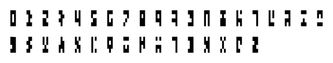
### [arthur-invisibles-cipher](https://www.dcode.fr/arthur-invisibles-cipher)
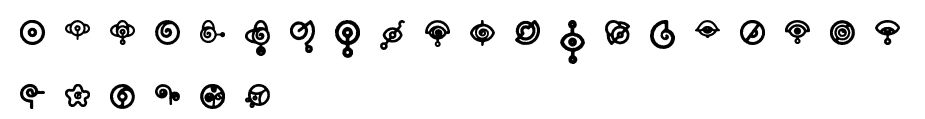
### [atlantean-language](https://www.dcode.fr/atlantean-language)
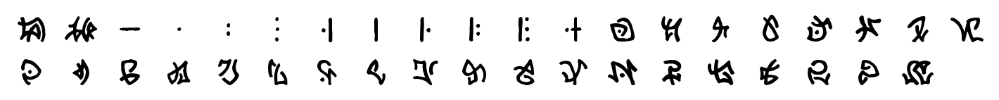
### [aurebesh-alphabet](https://www.dcode.fr/aurebesh-alphabet)
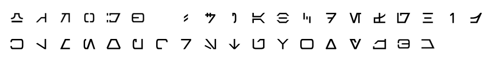
### [babylonian-numbers](https://www.dcode.fr/babylonian-numbers)
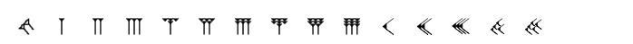
### [betamaze-cipher](https://www.dcode.fr/betamaze-cipher)
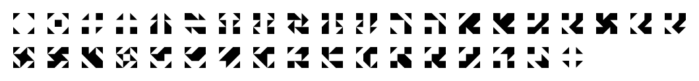
### [braille-alphabet](https://www.dcode.fr/braille-alphabet)
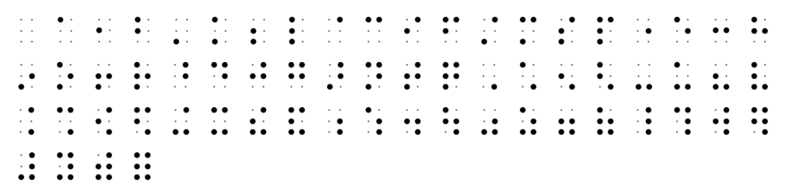
### [chinese-code](https://www.dcode.fr/chinese-code)
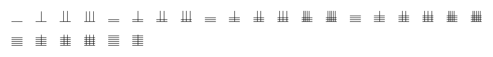
### [daggers-alphabet](https://www.dcode.fr/daggers-alphabet)
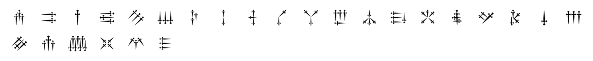
### [dancing-men-cipher](https://www.dcode.fr/dancing-men-cipher)

### [dotsies-writing](https://www.dcode.fr/dotsies-writing)
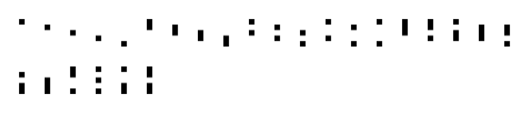
### [draconic-dragon-language](https://www.dcode.fr/draconic-dragon-language)
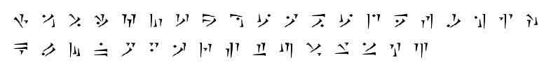
### [elder-futhark](https://www.dcode.fr/elder-futhark)

### [enochian-language](https://www.dcode.fr/enochian-language)
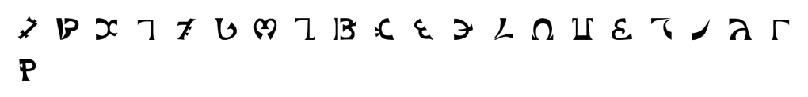
### [french-sign-language](https://www.dcode.fr/french-sign-language)

### [futurama-alien-alphabet](https://www.dcode.fr/futurama-alien-alphabet)
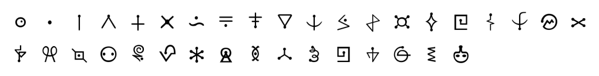
### [gerudo-language](https://www.dcode.fr/gerudo-language)
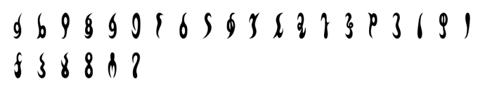
### [gnommish-alphabet](https://www.dcode.fr/gnommish-alphabet)
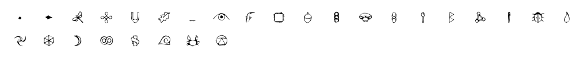
### [gravity-falls-author-cipher](https://www.dcode.fr/gravity-falls-author-cipher)
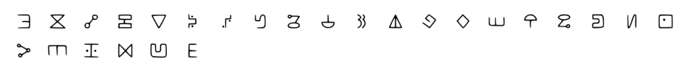
### [gravity-falls-bill-cipher](https://www.dcode.fr/gravity-falls-bill-cipher)

### [hylian-language-a-link-between-worlds](https://www.dcode.fr/hylian-language-a-link-between-worlds)

### [hylian-language-breath-of-the-wild](https://www.dcode.fr/hylian-language-breath-of-the-wild)
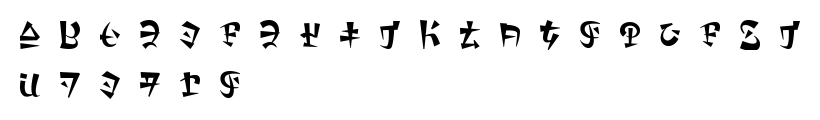
### [hylian-language-skyward-sword](https://www.dcode.fr/hylian-language-skyward-sword)
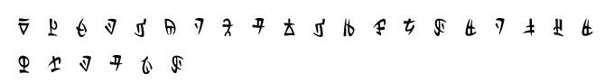
### [hylian-language-twilight-princess](https://www.dcode.fr/hylian-language-twilight-princess)
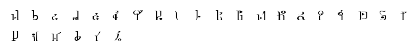
### [hymnos-alphabet](https://www.dcode.fr/hymnos-alphabet)

### [iokharic-language](https://www.dcode.fr/iokharic-language)
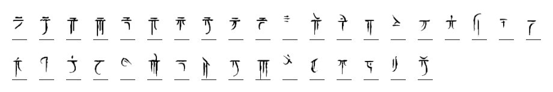
### [klingon-language](https://www.dcode.fr/klingon-language)
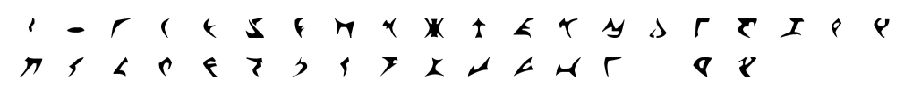
### [lingua-ignota-code](https://www.dcode.fr/lingua-ignota-code)
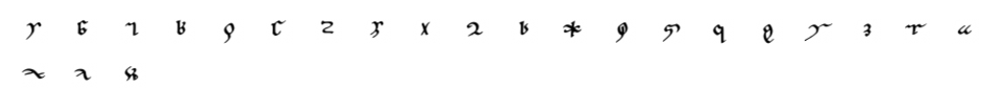
### [maritime-signals-code](https://www.dcode.fr/maritime-signals-code)
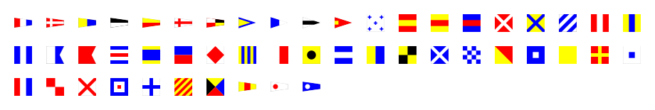
### [mary-stuart-code](https://www.dcode.fr/mary-stuart-code)
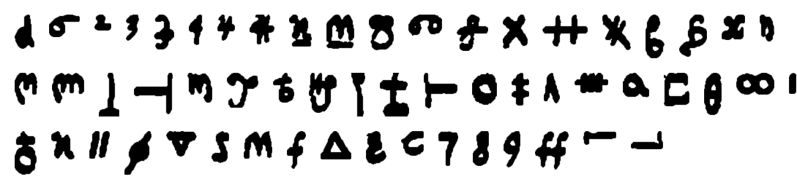
### [mayan-numbers](https://www.dcode.fr/mayan-numbers)
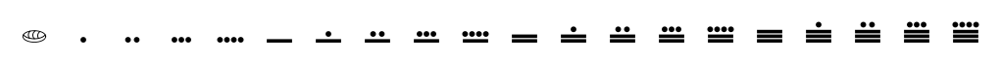
### [music-sheet-cipher](https://www.dcode.fr/music-sheet-cipher)
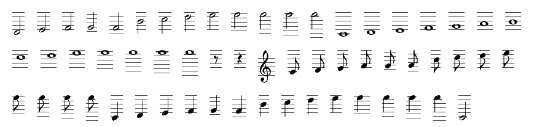
### [ogham-alphabet](https://www.dcode.fr/ogham-alphabet)
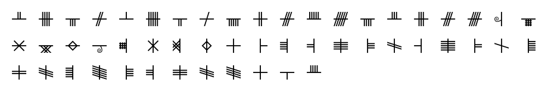
### [pigpen-cipher](https://www.dcode.fr/pigpen-cipher)
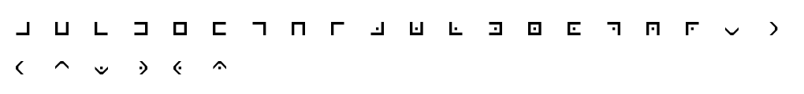
### [pokemon-unown-alphabet](https://www.dcode.fr/pokemon-unown-alphabet)
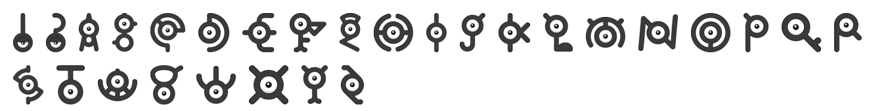
### [semaphore-flag](https://www.dcode.fr/semaphore-flag)
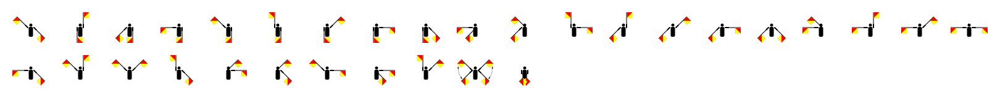
### [semaphore-trousers-cipher](https://www.dcode.fr/semaphore-trousers-cipher)
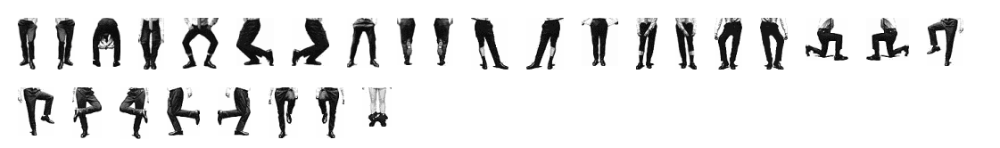
### [sheikah-language](https://www.dcode.fr/sheikah-language)
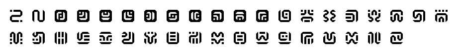
### [simlish-language](https://www.dcode.fr/simlish-language)
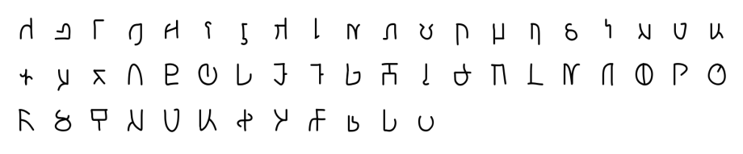
### [standard-galactic-alphabet](https://www.dcode.fr/standard-galactic-alphabet)

### [symbol-font](https://www.dcode.fr/symbol-font)
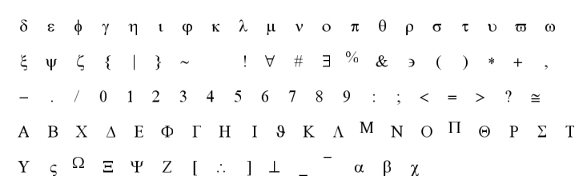
### [templars-cipher](https://www.dcode.fr/templars-cipher)
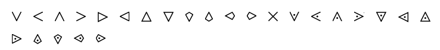
### [theban-alphabet](https://www.dcode.fr/theban-alphabet)
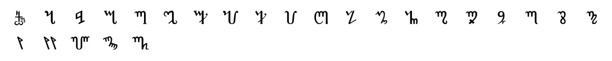
### [tic-tac-toe-cipher](https://www.dcode.fr/tic-tac-toe-cipher)
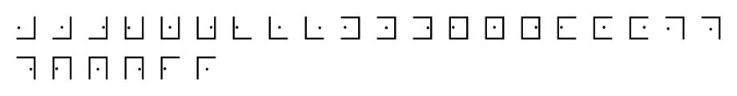
### [voynich-manuscript](https://www.dcode.fr/voynich-manuscript)
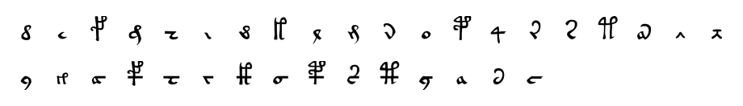
### [webdings-font](https://www.dcode.fr/webdings-font)
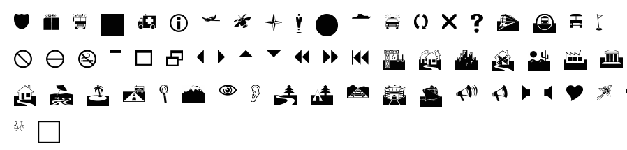
### [wingdings-font](https://www.dcode.fr/wingdings-font)
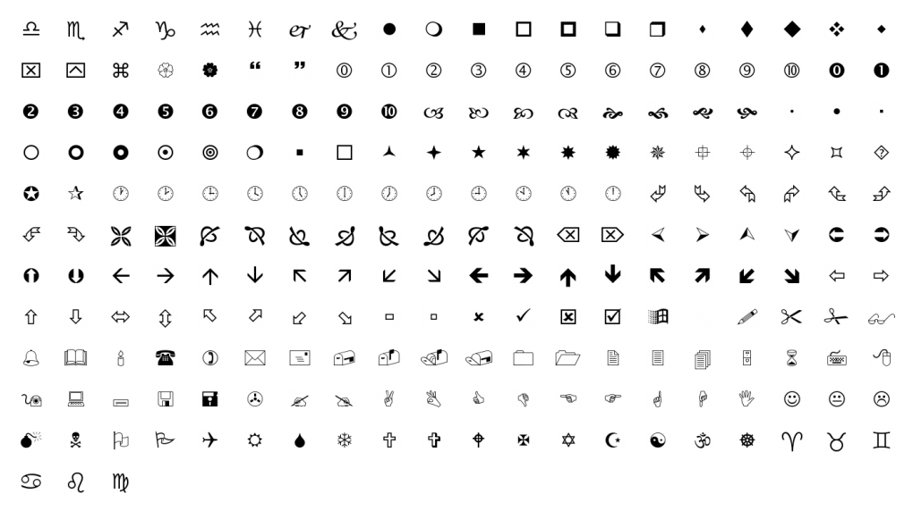
### [zodiac-killer-cipher](https://www.dcode.fr/zodiac-killer-cipher)
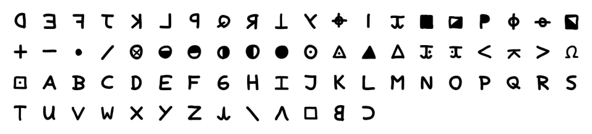