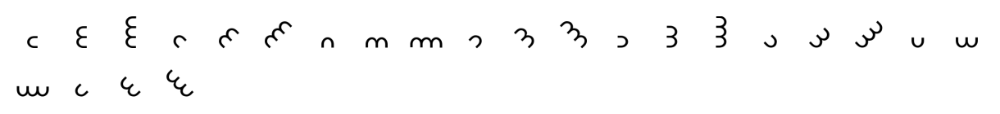

# Dorabella Cipher
Tool to decipher / encrypt like the Dorabella cipher, name given to a message coded by Edward Elgar, whose original plain message is not certain.

#### Charset: `ABCDEFGHIKLMNOPQRSTUWXYZ`

#### Tags: `dorabella, elgar, dora, edward, penny, semicircle, arc, circle`

#### Source: https://www.dcode.fr/dorabella-cipher

### Questions

### What is the Dorabella cipher?
Dorabella's cipher is the name given to a message sent by composer Edward Elgar dated July 14, 1897, in a letter to Dora Penny. The message takes the form of 86 characters (with 24 distinct characters) written on 3 lines: dorabella.png" loading="lazy" /> The 24 characters and their distribution (based on frequency analysis) are compatible with encryption by mono-alphabetical substitution. Edward Elgar never disclosed the original message but would have described his alphabet and substitution table as follows: LetterSymbolLetterSymbolLetterSymbolABCDEFGHI/JKLMNOPQRSTU/VWXYZ allowing the translation of the message into BPECAHTCKYFRQDRIRRHPPRDXYXGFSTRTHTCKLCERREHGQTRFRHUSQDXKKXFSESHUSEDUWGSERHUQSDCPGSHCDXC Other alphabets have been proposed but this message has never been clearly decrypted even if several people have tried various translations, none has convinced the community. The presence of a dot near the end of the first line is sometimes considered to be an 87th character (and therefore 25 distinct)

### How to encrypt using Dorabella cipher?
Based on the alphabet proposed by Edward Elgar, it is possible to encrypt a message with this alphabet of 24 symbols whose letters I,J and U,V are grouped together to be coded by the same symbol. Example: DORA is coded

### How to decrypt Dorabella cipher?
As the translation of the Dorabella message remains to be discovered, the decryption can only be based on the supposed 24-letter alphabet. The decryption principle is a substitution (replacement) of symbols with the corresponding letters in the alphabet. Example:  is decrypted BELLA

### How to recognize a Dorabella ciphertext?
Dorabella symbols are arc/semicircles/halfcircles assembled by 1, 2 or 3 and oriented in 8 directions ↑ ↗ → ↘ ↓ ↙ ← ↖ All references to Edward Elgar or Dora are clues.

### When Dorabella have been invented ?
The original message is dated July 14, 97 (for 1897)

