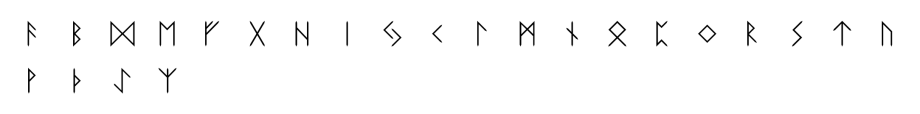

# Elder Futhark ᚠᚢᚦᚨᚱᚲ
Tools to decipher the Elder Futhark or write in this language using a runic alphabet whose traces persist in the writings of old Germanic peoples.

#### Charset: `ABDEFGHIJKLMNOPQRSTUWXYZ`

#### Tags: `futhark, elder, rune, runic, alphabet, germanic`

#### Source: https://www.dcode.fr/elder-futhark

### Questions

### How to encrypt/write in Elder Futhark?
The runic alphabet used in old futhark is composed of 24 characters, each with a possible transliteration with the Latin alphabet. To write in old futhark, to associate with each letter or sound of a message in French, his correspondence (or what is nearest) in old futhark according to the table:AᚨBᛒC/K/QᚲDᛞEᛖFᚠGᚷHᚺIᛁJ/YᛃLᛚMᛗNᚾNGᛝOᛟPᛈRᚱSᛋTᛏTHᚦUᚢV/WᚹYᛃZᛉ

### How to decrypt some Elder Futhark runes?
The decryption of old futhark begins with a substitution of runic characters into Latin characters to obtain an intelligible plain message. The plain message found may be a text written in some old language, whose translation into English will remain to be done. Example: ᚠ for f, ᚢ for u, ᚦ for th, ᚨ for a, ᚱ for ' r ', etc. Example:  is read FUTHARK

### How to recognize an Elder Futhark ciphertext?
The alphabet is composed of vertical or sloping lines, but never horizontal. A message can contain a maximum of 24 distinct characters. Most traces of the old futhark were found on runes, pieces of stones, pebbles on which were engraved runic characters.

### When Elder Futhark have been invented ?
The estimations indicates that this languages has been spoken from the second century to the eighth century AD.

