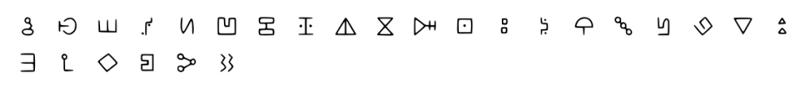

# Gravity Falls Bill Cipher
Tool to decode / encode with the cipher/language used by Bill Cipher in Gravity Falls. Bill is a triangle-shaped character, an evil dream demon master of illusions.

#### Charset: `ABCDEFGHIJKLMNOPQRSTUVWXYZ`

#### Tags: `bill, cipher, gravity, fall, triangle`

#### Source: https://www.dcode.fr/gravity-falls-bill-cipher

### Questions

#### How to encrypt using Bill Cipher cipher?
Bill Cipher has his own alphabet of 26 symbols, each corresponding to a letter of the Latin alphabet. To encrypt a message with Bill Cipher is therefore to replace each letter with the corresponding symbol. Example: BILL is written

#### How to decrypt Bill Cipher cipher?
Bill Cipher uses an alphabet of 26 symbols corresponding to the classic letters of the Latin alphabet. Decryption is to replace these symbols to get the original plain message. Example:  is translated GRAVITY

#### How to recognize a Bill Cipher ciphertext?
The symbols used by Bill Cipher are similar to the hyeroglyphs. In Gravity Falls, Bill has a triangle shape, he has only one eye, wears a hat and a bow tie, he is sometimes likened to the eye of providence, its presence could be a clue.

