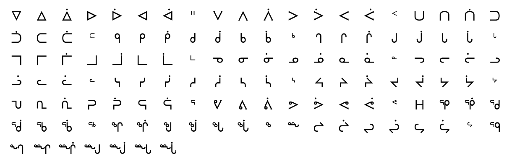

# Inuktitut Language
Tool to translate/read/write in Inuktitut, a language based on a syllabary alphabet used in northern Canada (especially by the Inuits).

#### Charset: `ᐁᐃᐄᐅᐆᐊᐋᐦᐯᐱᐲᐳᐴᐸᐹᑉᑌᑎᑏᑐᑑᑕᑖᑦᑫᑭᑮᑯᑰᑲᑳᒃᒉᒋᒌᒍᒎᒐᒑᒡᒣᒥᒦᒧᒨᒪᒫᒻᓀᓂᓃᓄᓅᓇᓈᓐᓓᓕᓖᓗᓘᓚᓛᓪᓭᓯᓰᓱᓲᓴᓵᔅᔦᔨᔩᔪᔫᔭᔮᔾᕃᕆᕇᕈᕉᕋᕌᕐᕓᕕᕖᕗᕘᕙᕚᕝᕼᕿᖀᖁᖂᖃᖄᖅᖏᖐᖑᖒᖓᖔᖕᖖᖠᖡᖢᖣᖤᖥᖦᙯᙰᙱᙲᙳᙴᙵᙶ`

#### Tags: `inuktitut, canada, language, syllabary, syllable`

#### Source: https://www.dcode.fr/inuktitut-language

### Questions

### What is Inuktitut? (Definition)
Inuktitut is a language (still existing) spoken and written by the inhabitants (generally Inuit) of northern Canada. Inuktitut uses a syllabary alphabet (words are made up of syllables, not letters).

### How to write in Inuktitut?
Writing in Inuktitut is writing syllables by syllables, Inuktitut has about 120. ᐁaiᐃiᐄiiᐅuᐆuuᐊaᐋaaᕼhᐦhᐯpaiᐱpiᐲpiiᐳpuᐴpuuᐸpaᐹpaaᑉpᑌtaiᑎtiᑏtiiᑐtuᑑtuuᑕtaᑖtaaᑦtᑫkaiᑭkiᑮkiiᑯkuᑰkuuᑲkaᑳkaaᒃkᒉgaiᒋgiᒌgiiᒍguᒎguuᒐgaᒑgaaᒡgᒣmaiᒥmiᒦmiiᒧmuᒨmuuᒪmaᒫmaaᒻmᓀnaiᓂniᓃniiᓄnuᓅnuuᓇnaᓈnaaᓐnᓭsaiᓯsiᓰsiiᓱsuᓲsuuᓴsaᓵsaaᔅsᓓlaiᓕliᓖliiᓗluᓘluuᓚlaᓛlaaᓪlᔦjaiᔨjiᔩjiiᔪjuᔫjuuᔭjaᔮjaaᔾjᕓvaiᕕviᕖviiᕗvuᕘvuuᕙvaᕚvaaᕝvᕃraiᕆriᕇriiᕈruᕉruuᕋraᕌraaᕐrᙯqaiᕿqiᖀqiiᖁquᖂquuᖃqaᖄqaaᖅqᙰngaiᖏngiᖐngiiᖑnguᖒnguuᖓngaᖔngaaᖕngᙱnngiᙲnngiiᙳnnguᙴnnguuᙵnngaᙶnngaaᖖnngᖠłiᖡłiiᖢłuᖣłuuᖤłaᖥłaaᖦł Some English syllables do not exist in Inuktitut and some Inuktitut syllables do not exist in English (like ł) Example: INUKTITUT is written ᐃᓄᒃᑎᑐᑦ dCode allows you to transcribe syllables into readable text or symbols but does not actually translate words (there is no English-Inuktitut translation dictionary)

### How to decrypt Inuktitut?
Reading Inuktitut consists of replacing the symbols / syllables with the corresponding pronunciations (groups of letters). Example: ᐃᓄᒃᑎᑐᑦ is read INUKTITUT

### How to recognize a Inuktitut ciphertext?
The message is composed of symbols mixing V-tips and loops, having representations in several directions as well as in mirror writing. Any reference to Canada and the Inuit prople is a clue.

