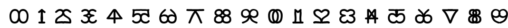

# Mirror Digits
Tool to convert the symbols of the mirror digits. Mirror digits are symbols formed from digits and their vertical symmetry (as seen in a mirror).

#### Charset: `0123456789ABCDEFGHIJ`

#### Tags: `mirror, digit, symmetry, infinite, arrow`

#### Source: https://www.dcode.fr/mirror-digits

### Questions

#### How to encrypt using Mirror Digits cipher?
Mirror figures are a deformation of Arabic numerals, but duplicated by vertical axial symmetry, hence the mirror effect. Example: 0 becomes  and looks like the infinite symbol Example: 1 becomes  and looks like an up arrow Digits may be transformed into symbols via a right or left symmetry Example: 2 becomes  or

#### How to decrypt Mirror Digits cipher?
Reading the mirror digits can be done by hiding half of the symbol (sometimes the left part, sometimes the right part), and thus find the original figure. Otherwise, replace each symbol with its number.

#### How to recognize Mirror Digits?
Symbols are usually associated with a riddle or puzzle of the type, complete the following series: Example: ... ? Example: ... ? Some people instantly recognize the digits, for others it's more complicated... Symbols are associated to drawings : Infinite, Double OChainUp arrowLetter M2 ducks, phoneHeartMouth, Kiss4-leaf cloverTree, ArrowBridge, Fence, ChairCupAppleGlassesCherriesPi, CrossTriangle4 Balls2 BallsScisors, NodeHeart

