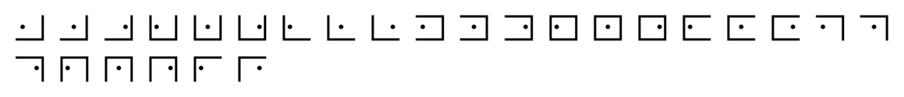

# Rosicrucian Cipher
Tool to decrypt / encrypt with the code of the Rosicrucians' order, a substitution cipher visually similar to the Pig-Pen cipher from the Freemasons.

#### Charset: `ABCDEFGHIJKLMNOPQRSTUVWXYZ`

#### Tags: `rosicrucian, rosy, cross, pigpen, freemason, dot, christian, rosenkreutz, crc`

#### Source: https://www.dcode.fr/rosicrucian-cipher

### Questions

### How to encrypt using Rosy Cross cipher?
The Rosicrucian encryption replaces each letter of the alphabet with a symbol (number by substitution) of which here is the correspondence table: LetterSymbolLetterSymbolLetterSymbolLetterSymbolABCDEFGHIJKLMNOPQRSTUVWXYZ Example: ROSE is translated

### How to decrypt Rosy Cross cipher?
The Rosicrucian decryption is the reverse operation of encryption and replaces each symbol with a letter of the Latin alphabet (see table above) Example:  is translated CROSS

### How to recognize a Rosicrucian ciphertext?
The message is made up of symbols which all have 2, 3 or 4 edges of a square with inside a point/dot positioned either to the right, or in the middle, or to the left of the square. The square is complete (4 edges) only for the letter N. Any reference to a secret order, to the character of Christian Rosenkreutz (CRC) or to Freemasonry are clues.

### What are the variants of the Rosicrucian cipher?
The pigpen cipher from the Freemasons has very similar symbols, similarly the Templar cipher is quite similar.

